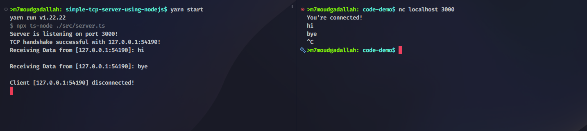

# Simple TCP Server

## Overview

- This is a simple TCP server demo built using Node.js's `net` module. It demonstrates basic TCP communication by establishing a server that listens for incoming connections, receives data from clients, and logs the interactions.

## Implementation Details

- The server is implemented in TypeScript using the `net` module provided by Node.js. It creates a TCP server that listens on port 3000 of the localhost (127.0.0.1). Upon receiving a connection from a client, it sends a greeting message and logs incoming data from the client. It also logs when a client disconnects. The server handles termination events gracefully, closing the server when receiving SIGINT or SIGTERM signals.

## Setup Instructions

To run this demo:

1. Ensure you have Node.js installed on your system.
2. Clone the repository or download the source code files.
3. Navigate to the project directory in your terminal.
4. Install dependencies by running `yarn install` or `npm install` as you like.
5. Start the server by running `yarn start` if you are using yarn and run `npm start` if you are using npm.
6. Use a terminal utility such as Netcat to connect to the server (e.g., `nc 127.0.0.1 3000`).

Enjoy the demo!
